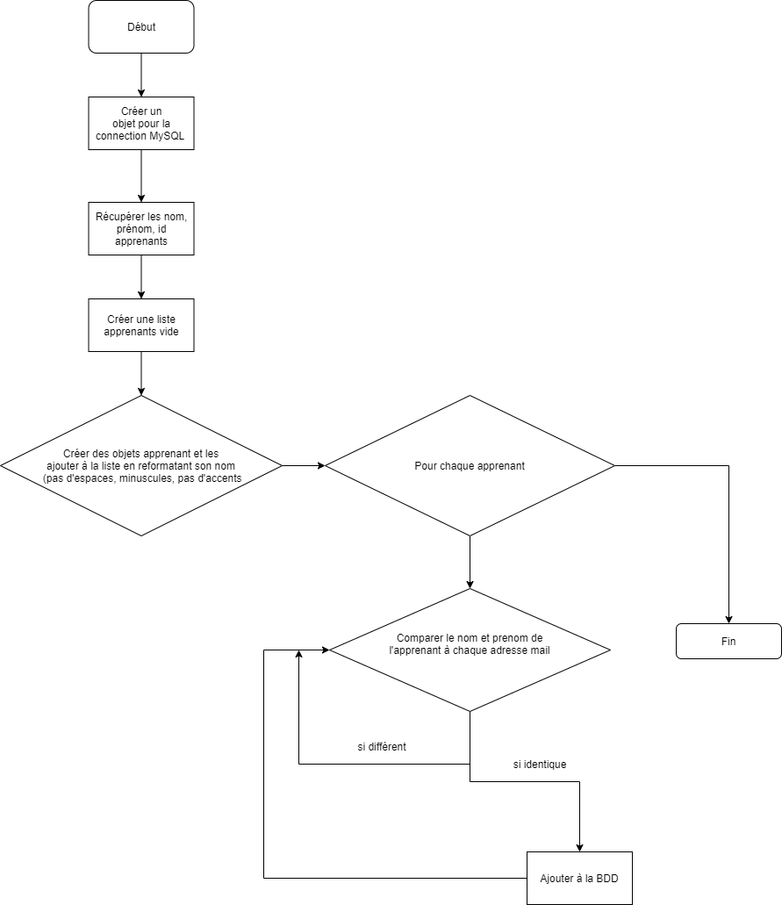
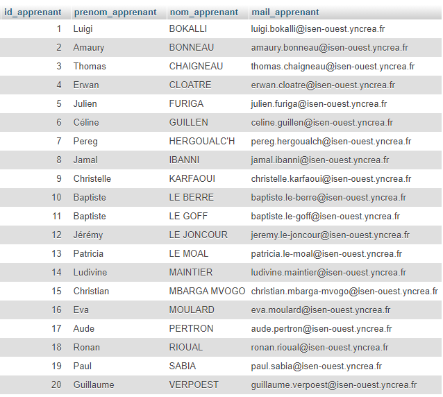

# Porjet mails_apprenants

## Details du fonctionnement

Permet d'ajouter une colonne mail_apprenant et entrer le mail pour chaque personne à partir d'un fichier txt.

Le code python est séparé en 4 fichier:
- Le script principal
- La class qui permet la liaison avec la base de donnéee
- La class qui crée des apprenants
- la classe qui lit le ficher txt

## L'algorithme

## Resultat final

